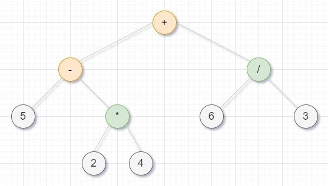
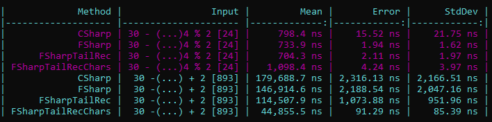

# Functional Arithmetic Evaluator

A small project I used to learn a bit more about function programming and F#.

The main idea was to write `C#` code as if it was `F#`.
So I decided on some roles:
* Immutable data only;
* Recursion only;
* Extension methods only;
* `FSharpList<>` only.

## The project
I always wanted to learn how a compiler/interpreter works.

So, since implementing a compiler with a new paradigm is not the best idea I found something easier, an **arithmetic evaluator**.

There are 3 main components:
* Lexer;
* Parser;
* Interpreter.

## Lexer

The [lexer](https://en.wikipedia.org/wiki/Lexical_analysis) scans the string, character by character, and creates a list of **tokens**.
Tokens are simple objects to assign meaning to a specific string.
```fsharp
type TokenType =
    | Operation = 0
    | Float     = 1
    
type Token = {
    Type: TokenType
    Value: string
}
```

So if we tokenize `30 - 10` we would get *3 tokens*: 2 represent a *float* number and 1 represents an *arithmetical operation*.

## Parser

The parser creates an [Abstract Syntax Tree](https://en.wikipedia.org/wiki/Abstract_syntax_tree) from the list of tokens.

When talking about programming languages, it represents the structure of the source code.
Here it represents the execution order.

For example `5 - 2 * 4 + 6 / 3` is represented by the following tree:



## Interpreter

The interpreter here is just an evaluator, it takes the **AST** as input and it visits the tree, evaluating partial results in each operation node.

## Key Takeaways

* Functional programming is not easy if your brain is wired for OOP. It will take time.
* It's fun! After years of C#, OOP becomes quite boring. F# is a great way to challenge yourself.
* Fewer lines of code. In this project, C# files are almost 2 times bigger.

### Range operator (strings)

The range operator for strings behaves differently between the two languages.
C# just call `String.Substring`, F# doesn't. Resulting in much slower results for the latter.
That's why in the F# code I am not using the *slicing* operator for strings.

I found this thanks to [FoggyFinder](https://github.com/FoggyFinder) when I asked for help in the [F# Forum](https://forums.fsharp.org/) after noticing super bad F# perforce (2x slower than C#).

### Tail recursion

Since F# enforce immutability, recursion is the way to go most of the time. But recursion is not as efficient as cycles.
Because of this F# compiler will convert recursive calls to iterations if the method is *tail-recursive*. 
Basically when the recursive call is the last this that happens in the method, **NOT the last written**.

To test this concept I wrote 4 versions of the Lexer:



* **C#** and **F#** use normal recursion;
* **F#TailRec**, obviously, uses tail recursion;
* **F#TailRecChar** uses tail recursion but it works on a list of character instead of substrings. And it looks like this version is great for very long expressions.

However, tail recursion can be a nightmare, at the beginning.
Look at the interpreter, the easier thing to implement recursively:

```fsharp
let rec evaluate node =
    match node with
    | ValueNode(v) -> v
    | OperationNode(b) ->
        let left = evaluate b.Left
        let right = evaluate b.Right
        match b.Type with
        | NodeType.Sum      -> left + right
        | NodeType.Subtract -> left - right
        | NodeType.Multiply -> left * right
        | NodeType.Divide   -> left / right
        | _                 -> left % right
```

With tail recursion it magically become the most difficult piece of code:
```fsharp
let evaluateTail node =
    let rec evaluateRec node op =
        match node with
        | ValueNode(v) -> op v
        | OperationNode(b) ->
            match b.Type with
            | NodeType.Sum      -> evaluateRec b.Left (fun left -> evaluateRec b.Right (fun right -> op(left + right) ))
            | NodeType.Subtract -> evaluateRec b.Left (fun left -> evaluateRec b.Right (fun right -> op(left - right) ))
            | NodeType.Multiply -> evaluateRec b.Left (fun left -> evaluateRec b.Right (fun right -> op(left * right) ))
            | NodeType.Divide   -> evaluateRec b.Left (fun left -> evaluateRec b.Right (fun right -> op(left / right) ))
            | _                 -> evaluateRec b.Left (fun left -> evaluateRec b.Right (fun right -> op(left % right) ))
    evaluateRec node (fun x -> x)
```

Even after writing it correctly it took me a day to understand why it was working!
And I have to thanks [this article](https://liangwu.wordpress.com/2010/07/17/the-basic-of-recursive-function-in-f/).

## Conclusions

I am far from being an F# expert but working on this greatly improved my understanding of functional programming.
I think this language is great and that is not so popular because of the steep learning curve, but it is worth the effort.
